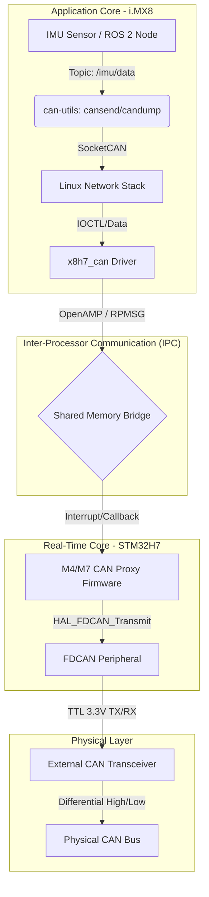

# Architecture Description
- The Arduino Portenta X8 has 2 main chips, the i.MX 8 Mini that has the embedded Linux, and the STM32H747 that is the real time core
- Main issues are that the IMU is connected to the i.MX, which is *not* real time. 
- Additionally, CAN bus connects via the STM32
- Arduino's distribution of Yocto Linux already contains a driver to bridge CAN-utils used in embedded Linux with the actual CAN bus on the STM32
- IMU data and PS3 controller input is streamed via ROS 2 topics
- Plan now is to use the embedded Linux as a forwarder of packets to the STM32, then use the 107-Arduino-Cyphal wrapper library to send Cyphal packets out over CAN (may need some sort of CAN driver)

