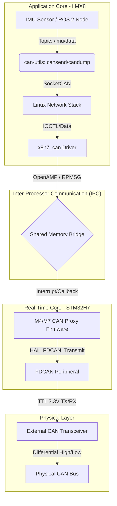

# Architecture Description
- The Arduino Portenta X8 has 2 main chips, the i.MX 8 Mini that has the embedded Linux, and the STM32H747 that is the real time core
- Main issues are that the IMU is connected to the i.MX, which is *not* real time. 
- Additionally, CAN bus connects via the STM32
- Arduino's distribution of Yocto Linux already contains a driver to bridge CAN-utils used in embedded Linux with the actual CAN bus on the STM32
- IMU data and PS3 controller input is streamed via ROS 2 topics
- Plan now is to use the embedded Linux as a forwarder of packets to the STM32, then use the 107-Arduino-Cyphal wrapper library to send Cyphal packets out over CAN (may need some sort of CAN driver)

# Flight Controller Architecture
- Since ROS 2 based, much of it is implemented in callback functions
- Main Node class runs the system
- Joy and Teleop packages used together to read the inputs from PS3 controller. These get advertised onto /cmd_vel topic
- IMU subscription callback feeds the IMU packet into an EsimatorBase object
- EstimatorBase is the base class for multiple different estimators: a complementary filter (based on Flix), direct pass-through using BNO085's internal orientation algorithm (yet to implement, but I'm hesitant to use as the accuracy of the orientation can't seem to converge)
	- This class returns an AttitudeEstimate struct containing the orientation estimate, validity boolean, and gyro reading (for cascaded control architectures)
	- Calling estimate() method of base class will return reference to internal estimate
	- If dt not valid, attitude not updated
- All topics are on QOS rules, but I have set them all to automatic for now as it is quite annoying having to deal with incompatible policies
	- Will eventually use YAML file to set their corresponding QOS policies
- ctrl_loop callback on a 1ms timer or 1kHz
	- Runs the main PID loop (or whatever else is configured)
	- An AttitudeController and RatesController class are combined in the CascadedController.h file
		- These make use of the PID class, implementing functionality like reset(), update(), etc. 