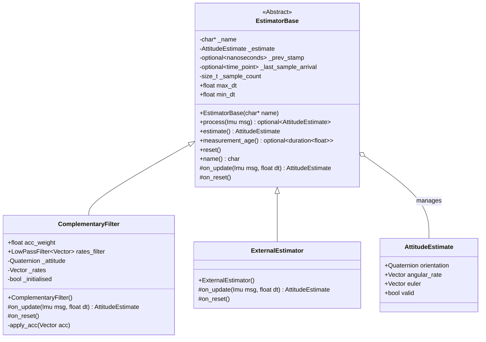

```mermaid
classDiagram
    class AttitudeEstimate {
        +Quaternion orientation
        +Vector angular_rate
        +Vector euler
        +bool valid
    }

    class EstimatorBase {
        <<Abstract>>
        -char* _name
        -AttitudeEstimate _estimate
        -optional~nanoseconds~ _prev_stamp
        -optional~time_point~ _last_sample_arrival
        -size_t _sample_count
        +float max_dt
        +float min_dt
        +EstimatorBase(char* name)
        +process(Imu msg) optional~AttitudeEstimate~
        +estimate() AttitudeEstimate
        +measurement_age() optional~duration~float~~
        +reset()
        +name() char
        #on_update(Imu msg, float dt) AttitudeEstimate
        #on_reset()
    }

    class ComplementaryFilter {
        +float acc_weight
        +LowPassFilter~Vector~ rates_filter
        -Quaternion _attitude
        -Vector _rates
        -bool _initialised
        +ComplementaryFilter()
        #on_update(Imu msg, float dt) AttitudeEstimate
        #on_reset()
        -apply_acc(Vector acc)
    }

    class ExternalEstimator {
        +ExternalEstimator()
        #on_update(Imu msg, float dt) AttitudeEstimate
        #on_reset()
    }

    EstimatorBase <|-- ComplementaryFilter
    EstimatorBase <|-- ExternalEstimator
    EstimatorBase o-- AttitudeEstimate : manages
```
