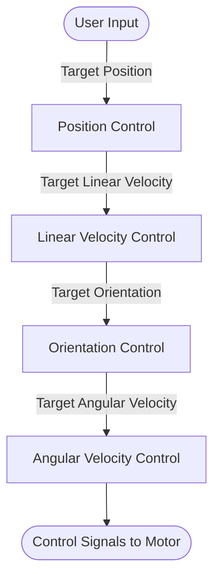

## Blog
https://habr.com/ru/articles/814127/

## State Estimation
- Complementary filter in *state estimation* subsystem combines the gyro and acceleration readings
	- In `estimate.ino`
## Control Loop
- Typical quadcopter control algorithms have multiple layers of control loops:

- Uses a cascaded control loop that controls the attitude and the angular velocity of the quadcopter (lowest level of cascade) 
	- In `control.ino`
- The user's input and the current attitude are used as inputs to the attitude control level, which itself outputs the desired angular velocity for the next level
- The angular velocity level uses a PID controller to determine the necessary control signals for the motors
- The motor control signals go to the motor mixer that actually delivers the correct controls to individual motors. See details [[Motor Mixer|here]].
- Control loop constrained by IMU frequency, which is set at 1 kHz

## Control Algorithm Flowchart ![[d2.svg]]