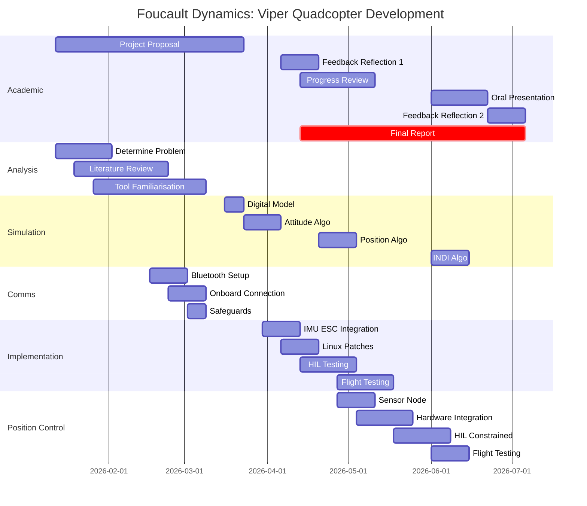

```mermaid
gantt
    title Foucault Dynamics: Viper Quadcopter Development
    dateFormat  YYYY-MM-DD
    section Academic
    Project Proposal           :a1, 2026-01-12, 70d
    Feedback Reflection 1      :a2, 2026-04-06, 14d
    Progress Review            :a3, 2026-04-13, 28d
    Oral Presentation          :a4, 2026-06-01, 21d
    Feedback Reflection 2      :a5, 2026-06-22, 14d
    Final Report               :crit, a6, 2026-04-13, 84d

    section Analysis
    Determine Problem          :p1, 2026-01-12, 21d
    Literature Review          :p2, 2026-01-19, 35d
    Tool Familiarisation       :p3, 2026-01-26, 42d

    section Simulation
    Digital Model              :s1, 2026-03-16, 7d
    Attitude Algo              :s2, 2026-03-23, 14d
    Position Algo              :s3, 2026-04-20, 14d
    INDI Algo                  :s4, 2026-06-01, 14d

    section Comms
    Bluetooth Setup            :w1, 2026-02-16, 14d
    Onboard Connection         :w2, 2026-02-23, 14d
    Safeguards                 :w3, 2026-03-02, 7d

    section Implementation
    IMU ESC Integration        :at1, 2026-03-30, 14d
    Linux Patches              :at2, 2026-04-06, 14d
    HIL Testing                :at3, 2026-04-13, 21d
    Flight Testing             :at4, 2026-04-27, 21d

    section Position Control
    Sensor Node                :pc1, 2026-04-27, 14d
    Hardware Integration       :pc2, 2026-05-04, 21d
    HIL Constrained            :pc3, 2026-05-18, 21d
    Flight Testing             :pc4, 2026-06-01, 14d
```
